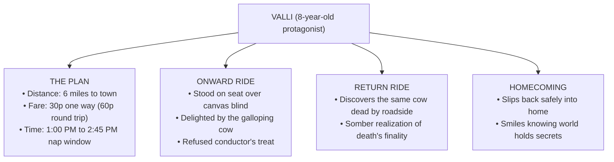

# ⚡ MADAM RIDES THE BUS: QUICK REVISION CAPSULE & MCQ TEST  

---

## 📌 PART 1: REVISION CAPSULE  

### 1. Facts, Figures & Logistics  

| Metric / Item | Exact Detail | Significance in Story |
| :--- | :--- | :--- |
| **Protagonist** | Valliammai (Valli), age 8 | Observant, dignified, remarkably self-disciplined. |
| **Distance & Duration** | 6 miles to town • 45 minutes one-way | Calculated to fit her mother's 1:00 to 4:00 PM nap. |
| **Total Fare** | 60 paise (30 paise each way) | Saved coin by coin; resisted fair rides & sweets. |
| **Bus Description** | White with green stripes, overhead silver bars | Luxurious soft seats, clock above windshield. |
| **The Comedy Point** | Young cow with tail held high galloping in front | Sparked pure childlike joy and laughter. |
| **The Epiphany Point** | Same cow struck dead, bloodied and spreadeagled | First direct brush with mortality; silences her joy. |

---

### 2. Character Distinctions  

* **Valli’s Fierce Independence:** Refused the conductor’s helping hand (*"I can get on by myself"*); declined his free cold drink; firmly asserted her paid passenger status (*"There's nobody here who's a child"*).  
* **The Bus Conductor:** Jolly, witty, and fond of joking; affectionately addressed her as *"Madam"* due to her grown-up, commanding demeanor.  
* **The Elderly Woman:** Betel-nut chewing, large ear holes, nosey questions (*"drivel"*); repulsive to Valli's fastidious nature.  
* **Theme of Maturation:** Transition from innocent curiosity about the world outside to understanding life's fragile, unpredictable boundaries.  

---

## 📝 PART 2: MCQ MASTERY TEST  

> *Select the correct option for each question. Click **Reveal Answer** to check your score and view the explanation.*  

---

#### Q1. Valli was able to save sixty paise for the bus trip mainly by `_______`.  
* (A) borrowing money from her neighbours  
* (B) running errands for the local shopkeepers  
* (C) resolutely stifling temptations to buy peppermints, toys, and ride the fair's merry-go-round  
* (D) taking coins from her mother's secret purse  

👁️ Reveal Answer

> **Correct Answer:** **(C) resolutely stifling temptations to buy peppermints, toys, and ride the fair's merry-go-round**  
> **Explanation:** Valli exercised extraordinary self-restraint at the village fair, preserving every stray coin for her goal.  

---

#### Q2. Why did the conductor playfully address eight-year-old Valli as "Madam"?  
* (A) She was dressed in an expensive formal sari.  
* (B) She carried an antique travel briefcase.  
* (C) She behaved like a self-sufficient, dignified adult and declined physical assistance.  
* (D) He confused her with someone else from town.  

👁️ Reveal Answer

> **Correct Answer:** **(C) She behaved like a self-sufficient, dignified adult and declined physical assistance.**  
> **Explanation:** Valli spoke commandingly, paid her own fare, and refused help boarding, prompting the jovial conductor to tease her respectfully as "madam".  

---

#### Q3. Why did Valli stand upon her seat during the onward journey?  
* (A) The seats were too hard to sit on comfortably.  
* (B) A lower canvas window blind obstructed her outside view.  
* (C) She wanted to show off her dress to passengers.  
* (D) The bus floor was wet and dirty.  

👁️ Reveal Answer

> **Correct Answer:** **(B) A lower canvas window blind obstructed her outside view.**  
> **Explanation:** The lower half of her window was fitted with a canvas blind; standing on the seat enabled her to peer over it.  

---

#### Q4. When the bus arrived at the town stop, Valli refused to get down and explore because she `_______`.  
* (A) was terrified of city traffic and only had thirty paise left for the return ticket  
* (B) had forgotten where her relatives lived  
* (C) was forbidden by the bus conductor to step out  
* (D) felt sick from the bumpy bus ride  

👁️ Reveal Answer

> **Correct Answer:** **(A) was terrified of city traffic and only had thirty paise left for the return ticket**  
> **Explanation:** Her goal was solely the bus ride experience; she lacked funds to spend in town and felt uneasy wandering alone.  

---

#### Q5. What caused Valli's lively enthusiasm to turn into quiet sorrow during her return trip?  
* (A) The conductor scolded her for standing up again.  
* (B) She saw the same playful young cow lying dead and bloodied by the roadside.  
* (C) She realized she had lost her return ticket coins.  
* (D) Heavy monsoon rain ruined the scenic views.  

👁️ Reveal Answer

> **Correct Answer:** **(B) She saw the same playful young cow lying dead and bloodied by the roadside.**  
> **Explanation:** Witnessing the lifeless, spreadeagled cow that had amused her just an hour earlier shocked her with the harsh reality of mortality.  

---

#### Q6. At the end of the story, when her mother comments on things occurring without our knowledge, Valli smiles secretly because `_______`.  
* (A) she had hidden a stash of sweets under her bed  
* (B) she had successfully journeyed to town and back completely undetected  
* (C) she was mocking her chatty aunt from South Street  
* (D) she planned to run away to the city permanently the next morning  

👁️ Reveal Answer

> **Correct Answer:** **(B) she had successfully journeyed to town and back completely undetected**  
> **Explanation:** Valli's smile holds the private triumph of having ventured into the outside world and returned safely while her mother remained none the wiser.  

