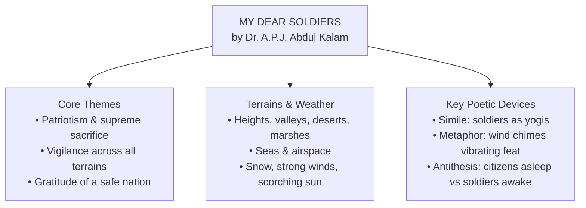

# ⚡ MY DEAR SOLDIERS: QUICK REVISION CAPSULE & MCQ TEST  

---

## 📌 PART 1: REVISION CAPSULE  

### 1. At a Glance  

| Element | Key Takeaway | Real Line from Poem |
| :--- | :--- | :--- |
| **Poet & Form** | Dr. A.P.J. Abdul Kalam • Free verse hymn | *"Oh! Defenders of borders..."* |
| **Central Contrast** | Citizens resting safely vs. soldiers on relentless guard | *"When we are all asleep / You still hold on to your deed"* |
| **The Sacrificial Cost** | Surrendering youthful comforts for country | *"Prime of your youth given to the nation!!"* |
| **Tone** | Reverent, grateful, admiring, prayerful | *"May the Lord bless you all!!"* |

---

### 2. Poetic Devices Cheat Sheet  

* **Simile:** Compares soldiers to ascetic hermits to highlight detached, disciplined selflessness.  
  👉 *"Treading the lonely expanses as **yogis**"*  
* **Metaphor & Personification:** Nature's breezes ringing wind chimes represent the entire land celebrating their victories.  
  👉 *"Wind chimes of my land **vibrate your feat**"*  
* **Antithesis:** Direct juxtaposition between civilian comfort and military hardship.  
  👉 *"When we are all **asleep** / You still hold on... **awake**"*  
* **Alliteration:** Repeated harsh consonant sounds emphasizing brutal environmental conditions.  
  👉 ***s**eason or **s**nowy* / ***sc**orching **s**un's **sw**eltering rays*  
* **Asyndeton:** Rapid listing of multi-dimensional defense operations without conjunctions.  
  👉 *"Climbing the heights... striding the valleys / Defending the deserts... guarding the marshes"*  

---

## 📝 PART 2: MCQ MASTERY TEST  

> *Select the correct option for each question. Click **Reveal Answer** to check your score and view the explanation.*  

---

#### Q1. The poet directly compares the soldiers to yogis primarily to highlight their `_______`.  
* (A) physical strength and combat tactics  
* (B) disciplined, selfless existence in remote solitude  
* (C) religious practices and rituals  
* (D) desire to abandon worldly battles  

👁️ Reveal Answer

> **Correct Answer:** **(B) disciplined, selfless existence in remote solitude**  
> **Explanation:** Like ascetics (yogis) who renounce material luxury and live in desolate stretches, soldiers dedicate themselves selflessly in harsh, lonely borders.  

---

#### Q2. In the line *"Wind chimes of my land vibrate your feat"*, the literary device used is a `_______`.  
* (A) hyperbole  
* (B) pun  
* (C) metaphor  
* (D) oxymoron  

👁️ Reveal Answer

> **Correct Answer:** **(C) metaphor**  
> **Explanation:** The wind chimes echoing in the breeze serve as a metaphor for the land and nature actively reverberating the heroic triumphs (*feat*) of the soldiers.  

---

#### Q3. The lines *"When we are all asleep / You still hold on to your deed"* create an impactful `_______`.  
* (A) antithesis  
* (B) transferred epithet  
* (C) onomatopoeia  
* (D) internal rhyme  

👁️ Reveal Answer

> **Correct Answer:** **(A) antithesis**  
> **Explanation:** It sets contrasting realities side by side: the unaware sleeping citizens versus the alert soldiers guarding the borders.  

---

#### Q4. The phrase *"Prime of your youth given to the nation!!"* emphasizes the soldiers' `_______`.  
* (A) lack of career options  
* (B) ultimate sacrifice of their golden years  
* (C) physical athletic abilities  
* (D) desire for early pension benefits  

👁️ Reveal Answer

> **Correct Answer:** **(B) ultimate sacrifice of their golden years**  
> **Explanation:** It underscores that soldiers offer up the most energetic, promising period of their lives purely for national security.  

---

#### Q5. The overall tone of the concluding lines *"We pray for you brave men!! / May the Lord bless you all!!"* is `_______`.  
* (A) mournful and sorrowful  
* (B) neutral and descriptive  
* (C) prayerful and deeply reverent  
* (D) proud yet indifferent  

👁️ Reveal Answer

> **Correct Answer:** **(C) prayerful and deeply reverent**  
> **Explanation:** Dr. Kalam closes the hymn-like tribute with an earnest invocation of divine blessings and collective civilian gratitude.  

