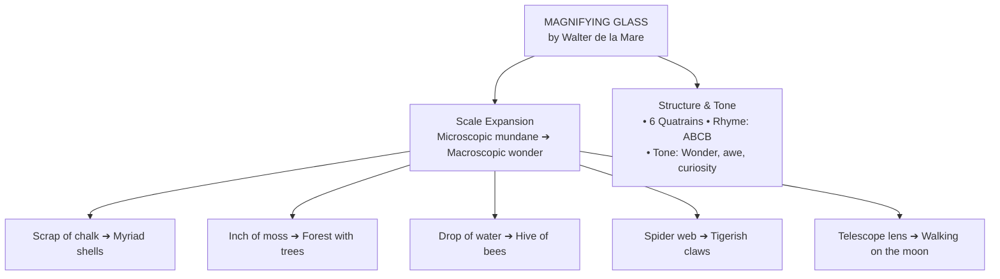

# ⚡ MAGNIFYING GLASS: QUICK REVISION CAPSULE & MCQ TEST  

---

## 📌 PART 1: REVISION CAPSULE  

### 1. Scale Conversion Table  

| Ordinary Object | Revealed Wonder Under Lens | Significance |
| :--- | :--- | :--- |
| **A scrap of chalk** | *"A myriad shells show"* | Exposes fossilized marine skeletons forming chalk. |
| **An inch of moss** | *"A forest—flowers and trees"* | Tiny stems appear as massive woodland canopies. |
| **A drop of water** | *"Like hive of bees"* | Microorganisms swimming appear like bustling swarms. |
| **A garden spider** | *"Tigerish claws... spinnerets"* | Transforms a tiny garden critter into a fierce hunter. |
| **The distant Moon** | *"Walk there in an afternoon"* | Expands lens power from micro-Earth to the cosmos. |

---

### 2. Core Poetic Devices  

* **Simile:** Explicit comparison with "like".  
  👉 *"A drop of water / **Like hive of bees**"*  
* **Metaphor:** Direct identification without comparative words.  
  👉 *"Of but an inch of moss / **A forest**—flowers and trees"*  
* **Personification / Oxymoron:** Merging scientific glass with conversational enchantment.  
  👉 *"I can make **Magic talk**"*  
* **Climactic Structure:** Escalates from hand-held debris (chalk, moss, pond water) upward to celestial bodies (the moon).  
* **Form & Meter:** 6 stanzas, 4 lines each (quatrain); **ABCB** end rhyme (*talk / chalk*, *trees / bees*, *glass / surpass*).  

---

## 📝 PART 2: MCQ MASTERY TEST  

> *Select the correct option for each question. Click **Reveal Answer** to check your score and view the rule applied.*  

---

#### Q1. When the speaker magnifies an inch of moss, it transforms metaphorically into a `_______`.  
* (A) buzzing hive of bees  
* (B) myriad of ancient shells  
* (C) dense forest of flowers and trees  
* (D) barren desert expanse  

👁️ Reveal Answer

> **Correct Answer:** **(C) dense forest of flowers and trees**  
> **Explanation:** The poet notes that through the glass, a tiny single inch of moss looks as complex and expansive as an entire forest.  

---

#### Q2. The line *"A drop of water / Like hive of bees"* employs a `_______` to describe microorganisms.  
* (A) metaphor  
* (B) simile  
* (C) hyperbole  
* (D) synecdoche  

👁️ Reveal Answer

> **Correct Answer:** **(B) simile**  
> **Explanation:** The explicit use of *"Like"* to compare a water droplet's microscopic activity to a crowded hive makes it a simile.  

---

#### Q3. The spider's predatory strength is emphasized through the descriptive phrase `_______`.  
* (A) *"woven web-silk"*  
* (B) *"tigerish claws"*  
* (C) *"deft spinnerets"*  
* (D) *"silly flies"*  

👁️ Reveal Answer

> **Correct Answer:** **(B) "tigerish claws"**  
> **Explanation:** Describing the small spider claws as *"tigerish"* portrays it as a ferocious apex predator under the lens.  

---

#### Q4. What is the structural rhyme scheme followed in the poem's quatrains?  
* (A) AABB  
* (B) ABAB  
* (C) ABCB  
* (D) ABBA  

👁️ Reveal Answer

> **Correct Answer:** **(C) ABCB**  
> **Explanation:** Each four-line stanza rhymes line 2 with line 4 (*talk / chalk*, *trees / bees*, *jets / spinnerets*, etc.).  

---

#### Q5. Shifting to the moon in the final stanza demonstrates that `_______`.  
* (A) the poet is tired of observing earthly things  
* (B) microscopic lenses and astronomical telescopes share the same power of unveiling wonder  
* (C) space travel was common during the poet's era  
* (D) the moon is made up of chalk and moss  

👁️ Reveal Answer

> **Correct Answer:** **(B) microscopic lenses and astronomical telescopes share the same power of unveiling wonder**  
> **Explanation:** The poet connects optical lenses: whether zooming in on micro-details on Earth or zooming out to celestial objects, magnification dissolves distance and limitations.  

