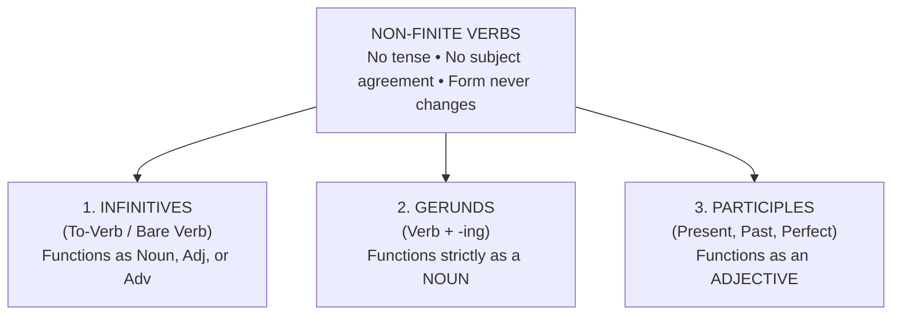
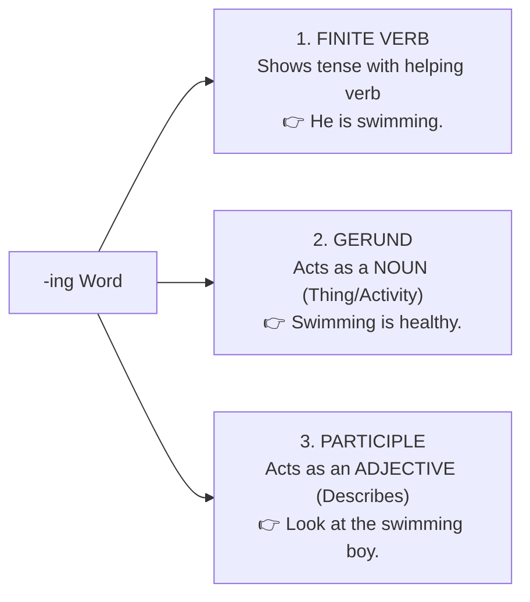

# ⚡ NON-FINITE VERBS: QUICK REVISION CAPSULE & MCQ TEST  

---

## 📌 PART 1: REVISION CAPSULE  

### 1. Finite vs. Non-Finite (The Core Difference)  

| Feature | Finite Verb | Non-Finite Verb |
| :--- | :--- | :--- |
| **Changes with Tense?** | ✅ Yes (*wants* ➔ *wanted*) | ❌ No (*to go* stays *to go*) |
| **Changes with Subject?** | ✅ Yes (*I swim* ➔ *he swims*) | ❌ No (*swimming* stays *swimming*) |
| **Has a Subject?** | ✅ Always | ❌ Never has its own grammatical subject |
| **Quick Example** | *He **goes** to market to buy milk.* | *He goes to market **to buy** milk.* |

---

### 2. The Big Three Breakdown  

#### 🅰️ Infinitives (Base Verb)  
* **To-Infinitive (`to + base verb`):**  
  * **As Subject / Object:** ***To err** is human.* / *I love **to read**.*  
  * **To Show Purpose:** *He called **to apologise**.*  
  * **Dummy "It" Construction:** *It is harmful **to eat** too much.* (Better than: *To eat too much is harmful.*)  
* **Bare Infinitive (Without `to`):**  
  * After modals (*can, must, should, will, might*): *You must **leave** now.*  
  * After verbs of perception (*see, hear, watch, feel, notice*): *I saw him **cross** the street.*  
  * After causative/special verbs (*make, let, bid*): *She made me **laugh**.* / *Let him **go**.*  
  * After *need / dare* in **negatives & questions**: *You need not **worry**.*  
    *(⚠️ Note: In affirmative sentences, use `to`: He dared **to dream**.)*  

---

#### 🅱️ Gerunds (Verbal Nouns: `Verb + -ing`)  
* Always acts like a **noun** (Answers the question: *"What?"*):  
  * **Subject:** ***Smoking** is prohibited.*  
  * **Direct Object:** *I enjoy **cooking**.*  
  * **Object of Preposition:** *She is tired of **waiting**.*  
  * **Subject Complement:** *My favourite pastime is **gardening**.*  

---

#### 🅲 Participles (Verbal Adjectives)  
* **Present Participle (`Verb + -ing`):** Active or ongoing action modifying a noun.  
  👉 *A **crying** baby woke the entire house.*  
* **Past Participle (`-ed / -en / -d / -t`):** Completed action / passive state.  
  👉 *They pulled the driver from the **wrecked** car.*  
* **Perfect Participle (`Having + Past Participle`):** One action finishes completely before the next starts.  
  👉 ***Having finished** his homework, he went out to play.*  

---

### 3. The Ultimate `-ing` Showdown  

One form, three completely different grammatical roles:  

---

## 📝 PART 2: MCQ MASTERY TEST  

> *Choose the correct non-finite form for each sentence. Click **Reveal Answer** to check your score and view the rule applied.*  

---

#### Q1. The headmaster made the mischievous boy `_______` the entire corridor after class.  
* (A) to clean  
* (B) clean  
* (C) cleaning  
* (D) cleaned  

👁️ Reveal Answer

> **Correct Answer:** **(B) clean**  
> **Explanation:** Verbs like *make*, *let*, and *bid* take a **bare infinitive** (base verb without *to*).  

---

#### Q2. Identify the function of the highlighted word: "**Loitering** near the examination hall is strictly prohibited."  
* (A) Present Participle  
* (B) Finite Verb  
* (C) Gerund  
* (D) Past Participle  

👁️ Reveal Answer

> **Correct Answer:** **(C) Gerund**  
> **Explanation:** *Loitering* acts as the grammatical subject of the sentence (answers: *"What is prohibited?"*), making it a verbal noun (gerund).  

---

#### Q3. `_______` all his money in a fraudulent scheme, he had to rely on his relatives.  
* (A) Having lost  
* (B) Losing  
* (C) Lost  
* (D) To lose  

👁️ Reveal Answer

> **Correct Answer:** **(A) Having lost**  
> **Explanation:** A **perfect participle** (*Having + past participle*) is used when the first action was completed before the second action began.  

---

#### Q4. You need not `_______` permission to use the laboratory today.  
* (A) to ask  
* (B) asking  
* (C) asked  
* (D) ask  

👁️ Reveal Answer

> **Correct Answer:** **(D) ask**  
> **Explanation:** *Need* used as a semi-modal auxiliary in negative sentences takes a **bare infinitive** without *to*.  

---

#### Q5. I felt something cold `_______` against my ankle in the dark room.  
* (A) to touch  
* (B) touch  
* (C) touched  
* (D) to have touched  

👁️ Reveal Answer

> **Correct Answer:** **(B) touch**  
> **Explanation:** Verbs of perception (*feel, hear, see, watch*) are followed by an object and a **bare infinitive**.  

---

#### Q6. Which of the highlighted words functions as a **PARTICIPLE**?  
* (A) She is fond of **singing** folk songs.  
* (B) **Walking** in the morning refreshes the mind.  
* (C) Be careful while getting off a **moving** bus.  
* (D) Stop **making** so much noise!  

👁️ Reveal Answer

> **Correct Answer:** **(C) Be careful while getting off a moving bus.**  
> **Explanation:** In (C), *moving* modifies the noun *bus* as an adjective (present participle). In all other options, the `-ing` word functions as a noun (gerund).  

---

#### Q7. The room was `_______` small to accommodate all fifty guests.  
* (A) very  
* (B) much  
* (C) too  
* (D) so  

👁️ Reveal Answer

> **Correct Answer:** **(C) too**  
> **Explanation:** The adverb **too** pairs with the `to-infinitive` construction (*too... to*) to express a negative outcome / limitation.  

---

#### Q8. She dared `_______` the authority of the corrupt committee.  
* (A) challenge  
* (B) to challenge  
* (C) challenging  
* (D) challenged  

👁️ Reveal Answer

> **Correct Answer:** **(B) to challenge**  
> **Explanation:** In **affirmative** sentences, *dare* functions as a regular verb and takes the full **to-infinitive** (*dared to challenge*).  

---

#### Q9. Replace the highlighted clause with an infinitive: "Our landlord was the last man **who left the apartment**."  
* (A) to leaving the apartment  
* (B) having left the apartment  
* (C) to leave the apartment  
* (D) for leaving the apartment  

👁️ Reveal Answer

> **Correct Answer:** **(C) to leave the apartment**  
> **Explanation:** Noun phrases with ordinals like *the first*, *the last*, or *the only* are compactly replaced with a **to-infinitive** (*the last man to leave*).  

---

#### Q10. Identify the sentence that contains a **Dangling (unattached) Participle**:  
* (A) Walking through the dense forest, the air felt cold and damp.  
* (B) Walking through the dense forest, we felt the cold air.  
* (C) Having finished her work, Sheela switched off the lights.  
* (D) Mesmerised by the music, the audience sat in complete silence.  

👁️ Reveal Answer

> **Correct Answer:** **(A) Walking through the dense forest, the air felt cold and damp.**  
> **Explanation:** The participle phrase *Walking through the dense forest* illogically attaches to *the air* instead of the person walking. Sentence (B) corrects this error.  

---

#### Q11. Farishta prefers reading `_______` outdoors.  
* (A) to playing  
* (B) than playing  
* (C) to play  
* (D) than to play  

👁️ Reveal Answer

> **Correct Answer:** **(A) to playing**  
> **Explanation:** The verb *prefer* takes the preposition **to** when comparing two gerunds (*prefers reading to playing*).  

---

#### Q12. In the sentence: "The **quivering** leaves of the willow trees rustled softly," the highlighted word is a:  
* (A) Gerund  
* (B) Finite verb  
* (C) Past participle  
* (D) Present participle  

👁️ Reveal Answer

> **Correct Answer:** **(D) Present participle**  
> **Explanation:** *Quivering* is a `verb + -ing` form describing the noun *leaves*, functioning as a verbal adjective (present participle).  

