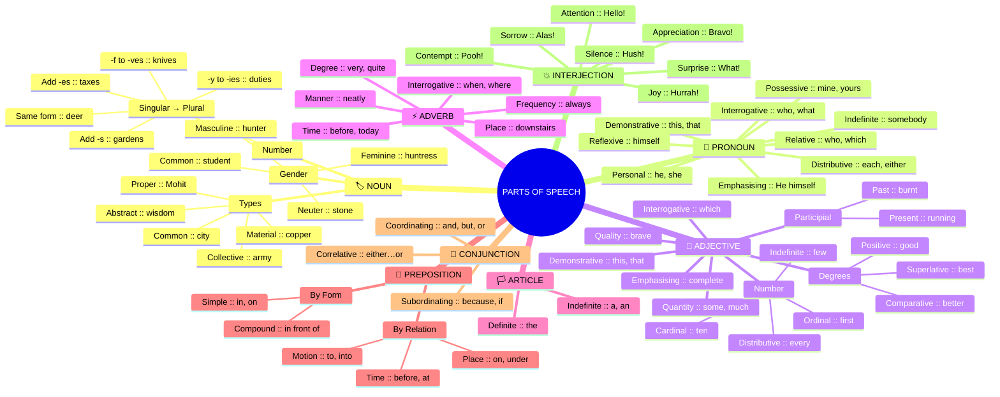
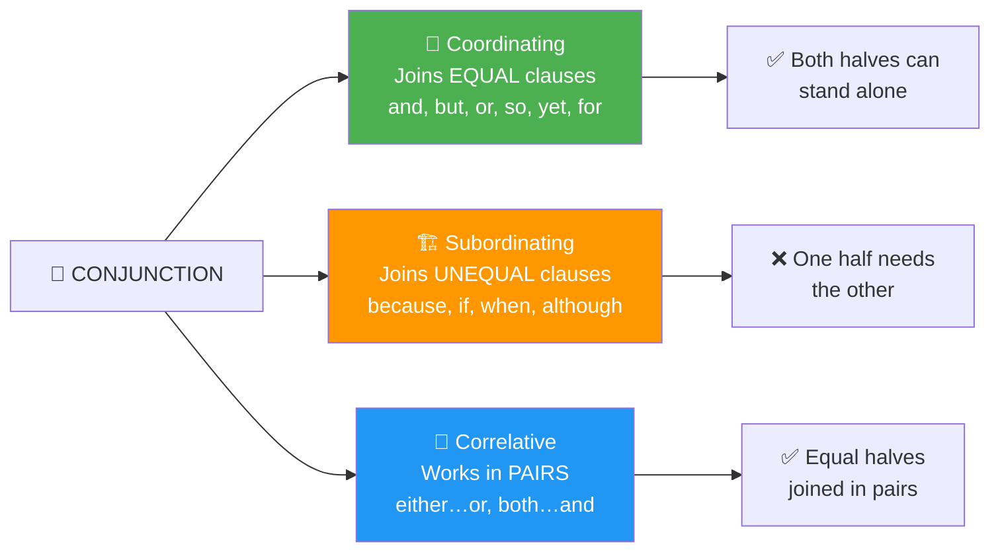
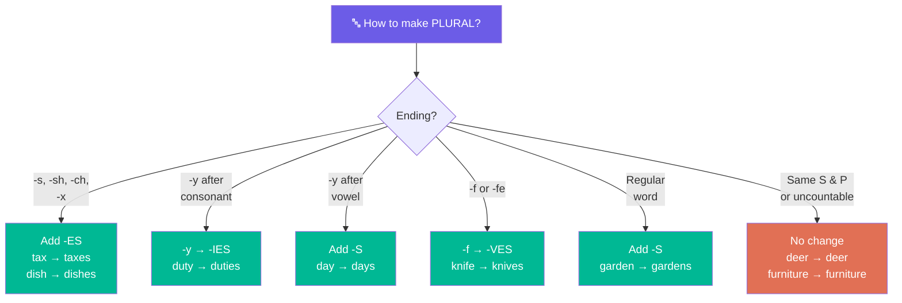
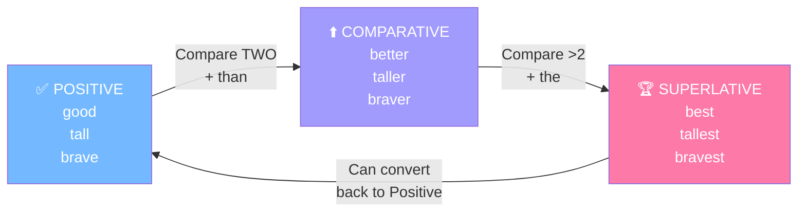
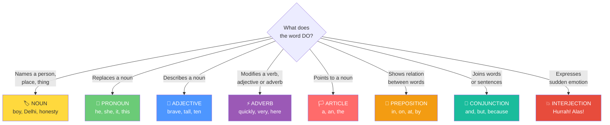

# 📚 PARTS OF SPEECH — Quick Reference  
### Based on Class VII & VIII English Grammar  

---  

## 📌 AT A GLANCE  

| # | Part of Speech | What it does | Key Question | Example |  
|---|---------------|-------------|--------------|---------|  
| 1 | 🏷️ **Noun** | Names something | What? Who? | *city, Mohit* |  
| 2 | 🔄 **Pronoun** | Replaces a noun | What? Who? | *he, she, it* |  
| 3 | 🎨 **Adjective** | Describes a noun | What kind? How many? | *brave, ten* |  
| 4 | ⚡ **Adverb** | Modifies verb/adj/adv | How? When? Where? | *quickly, always* |  
| 5 | 🏳️ **Article** | Points to noun | — | *a, an, the* |  
| 6 | 📍 **Preposition** | Shows relation | — | *in, on, at* |  
| 7 | 🔗 **Conjunction** | Joins words/clauses | — | *and, but, because* |  
| 8 | 💥 **Interjection** | Expresses emotion | — | *Hurrah! Alas!* |  

---  

## 🏷️ 1. NOUN  
> **Names a person, place, animal, thing, quality, or feeling**  

💬 *"Nainital is a beautiful city."*  

### Types  

| Type | Meaning | ✏️ Example |  
|------|---------|-----------|  
| 🏛️ **Proper** | Particular name | *Mohit, Taj Mahal* |  
| 🌍 **Common** | General name | *city, mountain* |  
| 👥 **Collective** | Group of things | *army, herd, jury* |  
| 💭 **Abstract** | Quality / action / state | *wisdom, honesty* |  
| 🧱 **Material** | Substance of things | *jute, copper, paper* |  

### Gender  

| Gender | Refers to | ✏️ Example | ⬅️ Opposite |  
|--------|-----------|-----------|------------|  
| 👨 **Masculine** | Male | *hunter* | huntress |  
| 👩 **Feminine** | Female | *tigress* | tiger |  
| 🪨 **Neuter** | Non-living | *stone, book* | — |  
| 🤝 **Common** | Male or Female | *student, orphan* | — |  

### Number (Singular → Plural)  

| 📏 Rule | Singular | Plural |  
|---------|----------|--------|  
| ➕ Add **-s** | garden | garden**s** |  
| ➕ Add **-es** (ending -x, -ch, -s, -sh) | tax, dish | tax**es**, dish**es** |  
| 🔀 **-y** → **-ies** (after consonant) | duty | dut**ies** |  
| 🔀 **-y** → **-ys** (after vowel) | day | day**s** |  
| 🔀 **-f/-fe** → **-ves** | knife, calf | kni**ves**, cal**ves** |  
| ✖️ Same singular & plural | deer, fish | deer, fish |  
| 🚫 Uncountable (always singular) | furniture, advice | — |  

> 💡 **Remember!**  
> Nouns like *scenery, furniture, advice, information, machinery* are **always singular** — you can never say *advices* or *furnitures*.  

---  

## 🔄 2. PRONOUN  
> **Takes the place of a noun**  

💬 *"Mohit is an athlete. **He** practises regularly."*  

### Types  

| Type | Meaning | ✏️ Example |  
|------|---------|-----------|  
| 👤 **Personal** | Replaces person / thing | *I, he, she, it, they* |  
| 🏠 **Possessive** | Shows ownership | *mine, yours, theirs* |  
| 👈 **Demonstrative** | Points out objects | *this, that, these, those* |  
| ❓ **Interrogative** | Used to ask questions | *who, what, which* |  
| 🪞 **Reflexive** | Subject = object | *himself, herself, itself* |  
| 💪 **Emphasising** | For emphasis only | *He **himself** did it.* |  
| 🌫️ **Indefinite** | Non-specific person | *somebody, few, everyone* |  
| 1️⃣ **Distributive** | Refers one at a time | *each, either, neither* |  
| 🔗 **Relative** | Connects clause to noun | *who, which, that* |  

> 💡 **Remember!**  
> - **who** → for people  
> - **which** → for things / animals  
> - **that** → for people AND things  

---  

## 🎨 3. ADJECTIVE  
> **Describes a noun or pronoun**  

💬 *"He is a **brave** soldier."*  

### Types  

| Type | Meaning | ✏️ Example |  
|------|---------|-----------|  
| 🎭 **Quality** | What kind | *brave, kind, beautiful* |  
| 📏 **Quantity** | How much | *some, much, enough* |  
| 🔢 **Number** | How many / what order | *ten, first, few* |  
| 👈 **Demonstrative** | Points to specific noun | *this, that, these* |  
| ❓ **Interrogative** | Asks about noun | *which, whose* |  
| ✨ **Emphasising** | Adds emphasis | *complete, very* |  
| 🏃 **Participial (present)** | Verb + -ing as adj | *running stream* |  
| 📦 **Participial (past)** | Verb + -ed/-t/-n as adj | *burnt cottage* |  

### Number — Subtypes  

| Subtype | Meaning | ✏️ Example |  
|---------|---------|-----------|  
| 🔢 **Cardinal** | Exact count | *one, twenty, hundred* |  
| 🥇 **Ordinal** | Order in series | *first, second, last* |  
| 🌫️ **Indefinite** | Not exact number | *few, many, several* |  
| 1️⃣ **Distributive** | One at a time | *every, each, either* |  

### Degrees of Comparison  

| Degree | When to use | ✏️ Example |  
|--------|-------------|-----------|  
| ✅ **Positive** | No comparison | *good* |  
| ⬆️ **Comparative** | Compare **two** things | *better* |  
| 🏆 **Superlative** | Compare **more than two** | *best* |  

> 💡 **Remember!**  
> - Comparative uses **than** → *"She is taller **than** me."*  
> - Superlative uses **the** → *"She is **the** tallest."*  

---  

## ⚡ 4. ADVERB  
> **Modifies a verb, adjective, or another adverb**  

💬 *"Rahim writes **neatly**."*  

### Types  

| Type | Answers | ✏️ Example |  
|------|---------|-----------|  
| ⏰ **Time** | When? | *before, today* |  
| 🔁 **Frequency** | How often? | *always, rarely* |  
| 📍 **Place** | Where? | *downstairs, out* |  
| 🎭 **Manner** | How? | *neately, carefully* |  
| 📏 **Degree** | How much? | *very, quite* |  
| ❓ **Interrogative** | Asks questions | *when, where, how, why* |  

> 💡 **Remember!**  
> - **Very** → with adjective/adverb in positive degree → *"**very** nice"*  
> - **Too** → means "more than needed" → *"**too** tired to play"*  
> - **Much** → with comparative → *"**much** better"*  

---  

## 🏳️ 5. ARTICLE  
> **A special adjective that points to nouns**  

💬 *"**An** empty bottle. **The** moon."*  

| Type | Words | What it does | ✏️ Example |  
|------|-------|-------------|-----------|  
| 🔀 **Indefinite** | **a, an** | Non-specific noun | *a desk, an orange* |  
| 🎯 **Definite** | **the** | Specific / particular noun | *the Taj Mahal* |  

> 💡 **Remember!**  
> - **a** → before consonant **sound** → *a university* (y-sound)  
> - **an** → before vowel **sound** → *an honest man* (silent h)  
> - **the** → before unique things → *the sun, the moon*  

---  

## 📍 6. PREPOSITION  
> **Shows the relationship between a noun/pronoun and another word**  

💬 *"The baby is **on** the bed."*  

### Types by Relation  

| Type | Shows | ✏️ Example |  
|------|-------|-----------|  
| ⏰ **Time** | When? | *before, after, at, on, in* |  
| 📍 **Place / Position** | Where? | *on, under, behind, between* |  
| 🏃 **Motion / Direction** | Movement | *to, into, towards, across* |  

### Types by Form  

| Type | Meaning | ✏️ Example |  
|------|---------|-----------|  
| 1️⃣ **Simple** | One word | *in, on, at, by* |  
| 📝 **Compound / Phrase** | Multiple words | *in front of, because of* |  

> 💡 **Remember!**  
> - **beside** = by the side of → *"The cat sat **beside** me."*  
> - **besides** = in addition to → *"**Besides** this, he has two more."*  
> - **between** → for **two** things | **among** → for **more than two**  

---  

## 🔗 7. CONJUNCTION  
> **Joins words, phrases, or sentences**  

💬 *"I was late **but** I still managed to finish."*  

### 🧱 Before You Learn — What is a Clause?  

A **clause** is a group of words with a **subject** and a **verb**.  

| Clause Type | What it means | ✏️ Example | Complete? |  
|-------------|--------------|-----------|-----------|  
| ✅ **Independent** (Main) | Makes complete sense alone | *"She was tired."* | Yes |  
| ❌ **Dependent** (Subordinate) | Needs a main clause | *"because she was tired."* | No |  

### Types  

| Type | Joins | How? | ✏️ Example |  
|------|-------|------|-----------|  
| 🤝 **Coordinating** | Two **equal** clauses | Equal to equal | *and, but, or, so, yet, for* |  
| 🏗️ **Subordinating** | **Unequal** clauses | One needs the other | *because, although, when, if, unless* |  
| 👫 **Correlative** | Two **equal** clauses | Always in pairs | *either…or, neither…nor, both…and* |  

### 🔍 Easy Comparison  

| Type | Sentence | Equal or Unequal? |  
|------|----------|-------------------|  
| 🤝 Coordinating | I was tired **but** I went to the party. | ✅ Equal — both can be standalone sentences |  
| 🏗️ Subordinating | I left **because** I was tired. | ❌ Unequal — *"because I was tired"* alone is incomplete |  
| 👫 Correlative | **Neither** he **nor** I can do this. | ✅ Equal — joined in pairs |  

> 💡 **Remember!**  
> - **Coordinating** = **FANBOYS** → **F**or, **A**nd, **N**or, **B**ut, **O**r, **Y**et, **S**o  
> - **Subordinating** = words that make a clause "depend" on another → *because, when, if, although, since, after, before, unless*  

---  

## 💥 8. INTERJECTION  
> **Expresses sudden feeling or emotion**  

💬 *"**Hurrah!** We won the tournament."*  

| Emotion | ✏️ Interjections |  
|---------|-----------------|  
| 🎉 **Joy** | *Hurrah! Ha ha!* |  
| 😲 **Surprise** | *What! Oh! Good heavens!* |  
| 👋 **Drawing attention** | *Hello! Look! Listen!* |  
| 🤫 **Making silent** | *Hush! Shh!* |  
| 👏 **Appreciation** | *Bravo! Well done!* |  
| 🙄 **Contempt** | *Pooh! What a shame!* |  
| 😢 **Sorrow** | *Alas! Ah!* |  

---  

---  

# 📝 MCQ QUESTIONNAIRE  
### Click on each question to expand, then click **Answer** to check  

---  

## 🏷️ NOUN  

<strong>Q1.</strong> 🟡 Which of these is a <u>proper noun</u>?

A. city  
B. Taj Mahal  
C. beauty  
D. army  

✅ Answer

**B. Taj Mahal**  
→ Proper nouns name a **particular** person, place, or thing.  

  

<strong>Q2.</strong> 🟡 "Honesty is a virtue." What type of noun is <u>honesty</u>?

A. Common noun  
B. Collective noun  
C. Abstract noun  
D. Material noun  

✅ Answer

**C. Abstract noun**  
→ It names a **quality** (honesty).  

  

<strong>Q3.</strong> 🟡 The plural of <u>knife</u> is ___

A. knifes  
B. knifes  
C. knives  
D. knive  

✅ Answer

**C. knives**  
→ Nouns ending in *-fe* change to *-ves*.  

  

<strong>Q4.</strong> 🟡 "Jury agrees with the verdict." What gender is <u>jury</u>?

A. Masculine  
B. Feminine  
C. Neuter  
D. Common  

✅ Answer

**C. Neuter**  
→ Jury is a collective noun referring to a group, not male or female.  

  

---  

## 🔄 PRONOUN  

<strong>Q5.</strong> 🟢 Which is a <u>reflexive pronoun</u>?

A. he  
B. mine  
C. himself  
D. which  

✅ Answer

**C. himself**  
→ Reflexive pronouns are used when subject and object are the **same person**.  

  

<strong>Q6.</strong> 🟢 "Each of the students must submit the work." What type of pronoun is <u>each</u>?

A. Personal  
B. Indefinite  
C. Distributive  
D. Demonstrative  

✅ Answer

**C. Distributive**  
→ *Each* refers to persons/things **one at a time**.  

  

<strong>Q7.</strong> 🟢 "Who is at the door?" What type of pronoun is <u>who</u>?

A. Relative  
B. Interrogative  
C. Demonstrative  
D. Personal  

✅ Answer

**B. Interrogative**  
→ It is used to **ask a question**.  

  

---  

## 🎨 ADJECTIVE  

<strong>Q8.</strong> 🔵 Which is a <u>participial adjective</u>?

A. brave  
B. running  
C. ten  
D. this  

✅ Answer

**B. running**  
→ Present participle (*verb + -ing*) used as an adjective (e.g., *running stream*).  

  

<strong>Q9.</strong> 🔵 "She is the <u>tallest</u> girl in the class." Which degree of comparison?

A. Positive  
B. Comparative  
C. Superlative  
D. None  

✅ Answer

**C. Superlative**  
→ Used to compare **more than two**; preceded by *the*.  

  

<strong>Q10.</strong> 🔵 Which is an adjective of <u>number</u>?

A. some  
B. beautiful  
C. first  
D. very  

✅ Answer

**C. first**  
→ An **ordinal** adjective of number showing order in a series.  

  

---  

## ⚡ ADVERB  

<strong>Q11.</strong> 🟣 "He visits us <u>regularly</u>." What type of adverb?

A. Adverb of time  
B. Adverb of place  
C. Adverb of frequency  
D. Adverb of manner  

✅ Answer

**C. Adverb of frequency**  
→ Tells us **how often** something happens.  

  

<strong>Q12.</strong> 🟣 Which adverb answers the question <u>"How?"</u>

A. yesterday  
B. quickly  
C. upstairs  
D. always  

✅ Answer

**B. quickly**  
→ Adverbs of **manner** answer "How?"  

  

<strong>Q13.</strong> 🟣 "He is <u>very</u> tired." What type of adverb?

A. Adverb of place  
B. Adverb of degree  
C. Adverb of time  
D. Adverb of frequency  

✅ Answer

**B. Adverb of degree**  
→ Shows the **intensity** of *tired*.  

  

---  

## 🏳️ ARTICLE  

<strong>Q14.</strong> 🔴 "___ honest man spoke the truth." Choose the correct article.

A. A  
B. An  
C. The  
D. No article  

✅ Answer

**B. An**  
→ Used before words starting with a **silent h** (vowel sound).  

  

<strong>Q15.</strong> 🔴 "___ moon was shining." Choose the correct article.

A. A  
B. An  
C. The  
D. No article  

✅ Answer

**C. The**  
→ *The* is used before **unique objects** (the sun, the moon).  

  

---  

## 📍 PREPOSITION  

<strong>Q16.</strong> 🟠 "The cat jumped ___ the table." Choose the correct preposition.

A. in  
B. on  
C. into  
D. at  

✅ Answer

**C. into**  
→ Shows **motion/direction** (from outside to inside).  

  

<strong>Q17.</strong> 🟠 "She stood ___ me." What does the preposition show?

A. Time  
B. Place/Position  
C. Direction  
D. Manner  

✅ Answer

**B. Place/Position**  
→ *Beside* shows **where** someone stood.  

  

---  

## 🔗 CONJUNCTION  

<strong>Q18.</strong> ⚫ "I was tired <u>but</u> I went to the party." What type of conjunction is <u>but</u>?

A. Subordinating  
B. Coordinating  
C. Correlative  
D. Interjection  

✅ Answer

**B. Coordinating**  
→ *But* joins two **equal clauses**; both can stand alone as sentences.  

  

<strong>Q19.</strong> ⚫ "I left <u>because</u> I was tired." What type of conjunction is <u>because</u>?

A. Coordinating  
B. Correlative  
C. Subordinating  
D. Relative  

✅ Answer

**C. Subordinating**  
→ *"because I was tired"* is a **dependent clause** (cannot stand alone).  

  

<strong>Q20.</strong> ⚫ Which pair is a <u>correlative conjunction</u>?

A. and, but  
B. because, although  
C. either…or  
D. so, yet  

✅ Answer

**C. either…or**  
→ Correlative conjunctions always work in **pairs**.  

  

<strong>Q21.</strong> ⚫ "She was tired, ___ she finished the work on time." Choose the correct conjunction.

A. so  
B. but  
C. because  
D. or  

✅ Answer

**B. but**  
→ Shows **contrast** between being tired and finishing the work.  

  

---  

## 💥 INTERJECTION  

<strong>Q22.</strong> 🟤 "Alas! The old man died." What emotion does <u>Alas</u> express?

A. Joy  
B. Surprise  
C. Sorrow  
D. Appreciation  

✅ Answer

**C. Sorrow**  
→ *Alas* expresses **grief or sadness**.  

  

<strong>Q23.</strong> 🟤 "Bravo! Well done!" These interjections express ___

A. Sorrow  
B. Surprise  
C. Contempt  
D. Appreciation  

✅ Answer

**D. Appreciation**  
→ Used to **praise or applaud** someone.  

  

---  

## 🧩 MIXED — Identify the Part of Speech  

<strong>Q24.</strong> ⭐ In "The boy ran <u>quickly</u>," what part of speech is <u>quickly</u>?

A. Adjective  
B. Adverb  
C. Noun  
D. Preposition  

✅ Answer

**B. Adverb**  
→ It modifies the verb *ran* and answers "How?"  

  

<strong>Q25.</strong> ⭐ In "This is <u>mine</u>," what part of speech is <u>mine</u>?

A. Personal pronoun  
B. Possessive pronoun  
C. Demonstrative pronoun  
D. Reflexive pronoun  

✅ Answer

**B. Possessive pronoun**  
→ It shows **ownership/belonging**.  

  

<strong>Q26.</strong> ⭐ "<u>Hurrah!</u> We won!" What part of speech is <u>Hurrah</u>?

A. Noun  
B. Adverb  
C. Interjection  
D. Adjective  

✅ Answer

**C. Interjection**  
→ It expresses sudden **joy**.  

  

<strong>Q27.</strong> ⭐ In "The <u>captain</u> led the team," what type of noun is <u>captain</u>?

A. Proper noun  
B. Common noun  
C. Collective noun  
D. Abstract noun  

✅ Answer

**B. Common noun**  
→ It is a **general name** for a person, not a particular name.  

  

<strong>Q28.</strong> ⭐ "She wrote <u>beautifully</u>." What type of adverb?

A. Adverb of degree  
B. Adverb of frequency  
C. Adverb of manner  
D. Adverb of time  

✅ Answer

**C. Adverb of manner**  
→ It answers "How?" (*How did she write?*)  

  

<strong>Q29.</strong> ⭐ In "An apple a day keeps the doctor away," how many parts of speech are represented?

A. 5  
B. 6  
C. 7  
D. 8  

✅ Answer

**C. 7**  
→ Article (an), Noun (apple, day, doctor), Adjective (a), Verb (keeps), Preposition (away). Pronoun and Adverb are not present.  

  

<strong>Q30.</strong> ⭐ Which sentence uses a <u>correlative conjunction</u> correctly?

A. Neither he nor I are going.  
B. Either she or they is responsible.  
C. Both the teacher and the student were happy.  
D. Not only he helped but also she.  

✅ Answer

**C. Both the teacher and the student were happy.**  
→ *Both…and* is used correctly as a pair joining two equal nouns.  

  

---  

## 🏆 SCORE CARD  

| Range | Level |  
|-------|-------|  
| 26–30 | ⭐⭐⭐ Grammar Master! |  
| 20–25 | ⭐⭐ Well Done! |  
| 13–19 | ⭐ Keep Practising! |  
| Below 13 | 📖 Read the notes again! |  

---  

# 🗺️ MIND MAPS  

## 1. PARTS OF SPEECH — Full Tree  

---  

## 2. CONJUNCTION — Clause Explained  

---  

## 3. NOUN — Plural Rules  

---  

## 4. ADJECTIVE — Degrees of Comparison  

---  

## 5. QUICK IDENTIFICATION — Which Part of Speech?  

---  

*Source: Class VII & VIII English Grammar Notes*  

