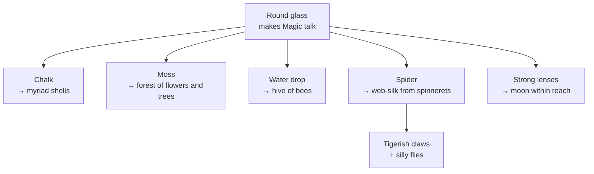

# Revision Notes — Magnifying Glass

> [!TIP]
> Cover each `
` answer, attempt it yourself, then expand to check.

---

## Snapshot

| Field | Detail |
| :---- | :----- |
| **Poet** | Walter de la Mare |
| **Type** | Poem |
| **Form** | Six quatrains |
| **Rhyme Scheme** | **ABCB** (lines 2 and 4 rhyme) |
| **Tone** | Wonder, curiosity, fascination |
| **Theme** | Close observation reveals hidden wonders in ordinary things |

---

## The Poem

> With this round glass
> I can make Magic talk—
> A myriad shells show
> In a scrap of chalk;
>
> Of but an inch of moss
> A forest—flowers and trees;
> A drop of water
> Like hive of bees.
>
> I lie in wait and watch
> How the deft spider jets
> The woven web-silk
> From his spinnerets;
>
> The tigerish claws he has!
> And oh! the silly flies
> The stumble into his net—
> With all those eyes!
>
> Not even the tiniest thing
> But this my glass
> Will make more marvellous
> And itself surpass.
>
> Yes, and with lenses like it,
> Eyeing the moon,
> 'Twould seem you'd walk there
> In an afternoon!

---

## Summary

Through a simple round magnifying glass, the poet sees magic in the mundane: a scrap of **chalk** reveals "a myriad shells", an inch of **moss** becomes a forest, and a **drop of water** looks like a hive of bees. He watches a spider spin "woven web-silk" from its spinnerets with "tigerish claws" and the "silly flies" that stumble into its net. The poem builds from tiny earthly objects to the **moon**, which a powerful lens could make seem close enough to walk on "in an afternoon".

---

## Stanza Map

| Stanza | Ordinary Thing | Magnified Wonder |
| :----: | :------------- | :--------------- |
| 1 | Scrap of chalk | A myriad shells |
| 2 | Inch of moss / drop of water | Forest of flowers and trees / hive of bees |
| 3 | Spider | Jets woven web-silk from spinnerets |
| 4 | Spider's claws / flies | Tigerish claws / silly flies caught in the net |
| 5 | Tiniest thing | Made more marvellous, the glass itself surpassed |
| 6 | The moon (via lenses) | Seems you could walk there in an afternoon |

---

## Poetic Devices

| Device | Example | Effect |
| :----- | :------ | :----- |
| **Metaphor** | "I can make Magic talk"; moss as a "forest" | The glass becomes magical; tiny moss seems vast. |
| **Simile** | "A drop of water / Like hive of bees" | Compares a droplet to a busy beehive. |
| **Personification** | "Magic talk"; spider with "tigerish claws" | Gives life and character to the glass and spider. |
| **Alliteration** | "deft spider", "woven web-silk", "myriad shells show" | Musical, rhythmic emphasis. |
| **Imagery** | "A myriad shells show / In a scrap of chalk" | Vivid visual pictures of magnified worlds. |
| **Exclamation** | "The tigerish claws he has!", "With all those eyes!" | Conveys excitement and wonder. |
| **Enjambment** | "Of but an inch of moss / A forest—flowers and trees" | Mirrors vision expanding through the lens. |
| **Oxymoron** | "Magic talk" | Tangible glass + supernatural magic. |
| **Climactic Structure** | Chalk → moss → water → moon | Escalating sense of wonder. |

---

## Vocabulary

| Word | Meaning |
| :--- | :------ |
| **myriad** | a countless number |
| **marvellous** | wonderful, astonishing |
| **deft** | skilful and quick |
| **jets** | shoots out in a stream |
| **spinnerets** | organs a spider spins silk from |
| **surpass** | to exceed, go beyond |
| **lens** | curved glass that magnifies |

---

## Worked Exercises

### I. Summary Fill-ups

<strong>Click to reveal answers</strong>

1. magnifying glass
2. chalk
3. moss
4. drop
5. bees
6. web-silk
7. spinnerets
8. moon

### II. Choose from brackets

<strong>Click to reveal answers</strong>

1. close observation
2. wonder and curiosity
3. six; four
4. ABCB

### III. Poetic device examples

<strong>Click to reveal answers</strong>

1. **Simile:** 'A drop of water / Like hive of bees.'
2. **Alliteration:** 'woven web-silk' (also 'wait and watch', 'myriad shells show')
3. **Metaphor:** 'A forest—flowers and trees' (an inch of moss compared to a forest)

### IV. Imagery

<strong>Click to reveal answers</strong>

1. Thousands of tiny, ancient shells hidden inside a small piece of chalk.
2. How a tiny patch of moss appears as vast and detailed as a whole forest when magnified.

### V. Complete with a reason

<strong>Click to reveal answers</strong>

1. It expresses the speaker's intense wonder, excitement and surprise at the hidden details revealed through magnification.
2. It gives the glass the human ability to speak and reveal hidden wonders as if by magic.
3. It supports the theme of hidden wonders in ordinary things, as the speaker reveals how magnification turns tiny objects into vast, marvellous worlds.
4. He wants to show that the power of magnification is limitless, bringing even distant worlds in the sky close to us.

---

## Active Recall — Questions

<strong>Q1. What is the significance of the spider?</strong>

Magnification reveals the spider's fierce, intricate details — its "tigerish claws" and how it skilfully spins "woven web-silk" from its spinnerets.

<strong>Q2. How would the speaker's view change without a magnifying glass?</strong>

He would see only ordinary chalk, moss and water, and would miss the hidden beauty, complexity and wonder within them.

<strong>Q3. Why does the poem end with the moon?</strong>

To show magnification has no limits — just as a lens reveals hidden worlds in tiny things, larger lenses bring distant celestial bodies close.

<strong>Q4. What is the speaker's attitude to nature and observation?</strong>

Deep curiosity, wonder and appreciation, believing close observation reveals hidden magic in everyday objects.

<strong>Q5. Which is your favourite part and why?</strong>

The description of an inch of moss turning into a forest of flowers and trees, because it vividly shows how magnification turns a tiny plant into an entire magical world.

<strong>Q6. Extract: is "The poet uses his magical powers to make the round glass powerful" true or false?</strong>

**False** — the lens, not magical powers, reveals the hidden details.

<strong>Q7. Select the line expressing intricate patterns in ordinary objects.</strong>

'A myriad shells show / In a scrap of chalk;'

<strong>Q8. How does the poet feel about the glass revealing hidden wonders?</strong>

B. **Fascinated**.

---

## Self-Test

- [ ] Write the rhyme scheme (ABCB) and prove it with two pairs.
- [ ] Name the six things magnified in order.
- [ ] Quote one simile and one alliteration.
- [ ] Explain "A forest—flowers and trees" in your own words.

---

## Quote Bank

> "Not even the tiniest thing / But this my glass / Will make more marvellous / And itself surpass."

> "A drop of water / Like hive of bees."

---

*Source: [C08 - 14 - MAGNIFYING GLASS - POETRY](002%20-%20CLASS%20VIII/LITERATURE/C08%20-%2014%20-%20MAGNIFYING%20GLASS%20-%20POETRY.md) · Back to [Master Index](README.md)*
