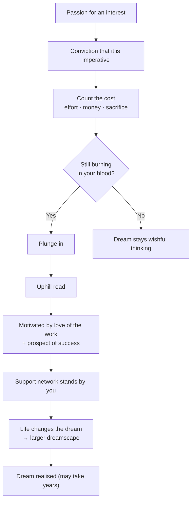

# Revision Notes — Follow That Dream

  
  
  

> [!TIP]
> Cover each `<details>` answer, attempt it yourself, then expand to check.

---

## Snapshot

| Field | Detail |
| :---- | :----- |
| **Author** | Irene Chua |
| **Source** | *My Daughter, My Friend* |
| **Form** | Personal letter (mother to teenage daughter, Ming) |
| **Date** | 19 June 1995 |
| **Tone** | Optimistic, encouraging, cautiously practical |
| **Theme** | Pursuing dreams through passion, conviction, sacrifice and realistic planning |

> [!TIP]
> **The Dream Formula:** Passion → Conviction → Count the Cost → Plunge → Persevere → Support Network → Adapt as life changes.

---

## Summary

Writing to her daughter Ming, the mother urges her to follow her dream — but wisely. Greatness comes from having a dream and pursuing it until it comes true; reaching **world-class** level demands at least **ten years** of single-minded pursuit. She advises Ming to start with passion, develop the conviction that the dream is imperative, count the cost in **years of effort, financial investment and sacrifice**, and only then "plunge". The road is uphill, sustained by love of the work and the prospect of success. Winners rely on a **support network**. Many dreams die as mere wishful thinking or are traded for security (e.g., the Japanese invasion stopped some from reaching Raffles College). The mother shares her own ten-year journey of publishing a book, noting that **dreams evolve** — now involving a larger "dreamscape" of people — and wishes at least one of Ming's dreams comes true.



---

## Key Ideas

| Idea | Explanation |
| :--- | :---------- |
| **The 10-year rule** | World-class skill needs singular, intensive pursuit for at least a decade. |
| **Passion → Conviction** | Interest must harden into the belief that the dream *must* be realised. |
| **Count the cost** | Weigh years, money and sacrifice before committing. |
| **Plunge** | Complete, whole-hearted involvement once conviction remains. |
| **Intrinsic motivation** | Love of the work and a sense of rightness keep you going when stamina fails. |
| **Support network** | Behind every winner is a group of people who stood by them. |
| **Dreams are not static** | Life can change dreams; new aspirations are no less valuable. |
| **Dreamscape** | The world of dreams, often involving many participants. |

> [!WARNING]
> "I am not going to put a **wet blanket** on your dreams" — the mother is *not* discouraging Ming; she is asking her to be realistic. Do not misread this as negative advice.

---

## Vocabulary

| Word | Meaning |
| :--- | :------ |
| **insight** | clear, deep understanding |
| **singularly** | exclusively; one thing alone |
| **imperative** | absolutely necessary |
| **plunge** | throw oneself fully into an activity |
| **buoyed up** | kept afloat; supported |
| **wistfully** | longingly |
| **dreamscape** | a world of dreams |
| **wet blanket** | a person/thing that spoils enthusiasm |

---

## Active Recall — True or False

<details>
<summary><strong>1. Reaching the peak of skill demands focused, intense dedication for about a decade.</strong></summary>

True.

</details>

<details>
<summary><strong>2. Significant effort and personal sacrifice are essential for turning aspirations into reality.</strong></summary>

True.

</details>

<details>
<summary><strong>3. The path to one's deepest desires has very little difficulty.</strong></summary>

False — the path is uphill and full of obstacles and sacrifices.

</details>

<details>
<summary><strong>4. A person's life goals and hopes can evolve over time.</strong></summary>

True.

</details>

<details>
<summary><strong>5. A strong network of individuals can be a hurdle in pursuing one's ambition.</strong></summary>

False — a support network helps and encourages rather than hinders.

</details>

<details>
<summary><strong>6. Pursuing a major life goal will not involve any financial expense or sacrifice.</strong></summary>

False — it involves years of effort, financial investment and sacrifice.

</details>

<details>
<summary><strong>7. For many, aspirations remain just wishes because they don't move beyond daydreaming.</strong></summary>

True.

</details>

---

## Active Recall — Extract & Short Answers

<details>
<summary><strong>Q1. "enthusiasm : passion :: belief : ___"</strong></summary>

**conviction**

</details>

<details>
<summary><strong>Q2. The word "plunge" indicates ___ involvement. (complete/gradual)</strong></summary>

**complete**

</details>

<details>
<summary><strong>Q3. Why is "doing what you love best" a form of intrinsic motivation?</strong></summary>

Because doing what one loves brings inner satisfaction and joy even when physical stamina is exhausted.

</details>

<details>
<summary><strong>Q4. What does "life itself may change a person's dreams" suggest?</strong></summary>

That dreams are not static but **evolving** — they grow and shift with life's circumstances.

</details>

<details>
<summary><strong>Q5. Identify the phrase showing a complex, challenging journey.</strong></summary>

"negotiate a path through a maze of hurdles".

</details>

<details>
<summary><strong>Q6. Why would the participants in your dreamscape be many more?</strong></summary>

Because as we grow older, our pursuits involve family, mentors, colleagues and collaborators.

</details>

<details>
<summary><strong>Q7. Tone of the second extract?</strong></summary>

C. **optimistic and encouraging**.

</details>

<details>
<summary><strong>Q8. What differentiates mere dreamers from actual achievers?</strong></summary>

Achievers count the costs, act decisively and endure years of hard work. Dreamers stop at wishful thinking, choose security, and let hurdles kill their aspirations.

</details>

<details>
<summary><strong>Q9. How can one attain international-level skill? Mention two ways.</strong></summary>

First, commit to intense, focused practice in the field for at least ten years. Second, be willing to make continuous sacrifices, maintain stamina, and overcome obstacles.

</details>

<details>
<summary><strong>Q10. How does the mother balance encouragement with caution?</strong></summary>

She warmly encourages Ming to plunge in if her passion is strong, but also advises her to realistically assess years of hard work, sacrifices, changing circumstances and financial costs.

</details>

<details>
<summary><strong>Q11. Is this advice relevant in contemporary society?</strong></summary>

Yes — achieving world-class excellence still requires years of discipline, resilience and family support. In our fast-paced world, resisting shortcuts and staying committed to long-term goals matters more than ever.

</details>

---

## Writing Task — Formal Email

### Guidelines

- Use formal language.
- Avoid abbreviations.
- Include header (sender, receiver, date, subject), message (introduction, permission, conclusion) and complementary close.
- Close with "Yours sincerely," plus name, designation and contact details.

### Format

```text
From:    sender@example.com
To:      receiver@example.com
Cc:
Bcc:
Subject: Clear, specific subject line

Dear Sir/Madam,

[Introduction → seeking permission/details → conclusion]

Yours sincerely,
Name
Designation, Contact details
```

### Model Email — Design Workshop Enquiry

```text
From:    rohit.sen99@gmail.com
To:      director@designinstitute.edu.in
Subject: Inquiry Regarding Summer Design Workshop 2026

Dear Sir/Madam,

I am a Class IX student at National Public School with a deep passion for
graphic and product design. I recently came across the announcement for the
upcoming Summer Design Workshop organised by your prestigious institute.

I am writing to express my eager interest in participating. Could you kindly
provide the following details?
  1. Exact dates, duration and daily timings of the sessions.
  2. The detailed course curriculum and software tools to be covered.
  3. Total course fees and the registration process.

I would be extremely grateful for your guidance. I look forward to your
response.

Yours sincerely,

Rohit Sen
Class IX, National Public School
Contact: +91 98765 43210
```

> [!CAUTION]
> Keep the subject specific, avoid abbreviations, and do not forget the sender's contact details.

---

## Self-Test

- [ ] Write the Dream Formula from memory.
- [ ] Explain the 10-year rule in one sentence.
- [ ] Distinguish intrinsic vs. extrinsic motivation here.
- [ ] Draft the workshop-enquiry email skeleton.

---

## Quote Bank

> "By all means follow that dream."

> "Count the cost in years of effort, financial investments and sacrifice."

> "I am not going to put a wet blanket on your dreams."

---

*Source: [C09 - 15 - FOLLOW THAT DREAM](003%20-%20CLASS%20IX/LITERATURE/C09%20-%2015%20-%20FOLLOW%20THAT%20DREAM.md) · Back to [Master Index](README.md)*
