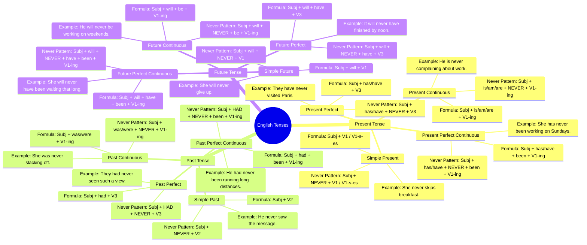

# MASTER TENSES GUIDE
A comprehensive reference covering Present, Past, and Future tenses, featuring explicit formulas, subject agreement distinctions (3rd Person Singular vs. Others), negative variations including **"never"** patterns, practical use cases, structural flowcharts, and interactive self-assessments.
---
## 🗺️ Tense Decision Architecture

---
## 📊 Complete Tense Master Matrix
> [!NOTE]  
> **Subject Categorization Key:**  
> • **III Sing:** 3rd Person Singular (`He`, `She`, `It`, Singular Nouns)  
> • **I:** 1st Person Singular  
> • **Others:** `You`, `We`, `They`, Plural Nouns
### 1. Present Tenses

| Tense | Subject Category | Structural Formula | Standard Negative | "Never" Negative Pattern | Practical Context & Function | Time Markers |
| :--- | :--- | :--- | :--- | :--- | :--- | :--- |
| **Present Indefinite** | **III Sing**  **Others / I** | `Subj + V₁-s/es`  `Subj + V₁` | `doesn't + V₁`  `don't + V₁` | `Subj + never + V₁-s/es` *(e.g., She **never eats** fast food.)*  `Subj + never + V₁` *(e.g., They **never eat** fast food.)* | • Habitual actions • Universal truths • Fixed schedules | `always` `usually` `every day` `never` |
| **Present Continuous** | **III Sing**  **I**  **Others** | `Subj + is + V₁-ing`  `I + am + V₁-ing`  `Subj + are + V₁-ing` | `isn't + V₁-ing`  `am not + V₁-ing`  `aren't + V₁-ing` | `is + never + V₁-ing` *(e.g., He **is never listening**.)*  `am + never + V₁-ing`  `are + never + V₁-ing` | • Actions happening right now • Temporary habits • Near-future plans | `now` `at present` `currently` `this week` |
| **Present Perfect** | **III Sing**  **Others / I** | `Subj + has + V₃`  `Subj + have + V₃` | `hasn't + V₃`  `haven't + V₃` | `has + never + V₃` *(e.g., She **has never seen** snow.)*  `have + never + V₃` *(e.g., I **have never seen** snow.)* | • Completed past actions with current impact • Life experiences | `already` `just` `yet` `never` `ever` |
| **Present Perfect Continuous** | **III Sing**  **Others / I** | `Subj + has been + V₁-ing`  `Subj + have been + V₁-ing` | `hasn't been + V₁-ing`  `haven't been + V₁-ing` | `has + never + been + V₁-ing` *(e.g., It **has never been working** properly.)*  `have + never + been + V₁-ing` | • Action started in past and continuing to present (focus on duration) | `for [duration]` `since [point]` `all day` |

---
### 2. Past Tenses

| Tense | Subject Category | Structural Formula | Standard Negative | "Never" Negative Pattern | Practical Context & Function | Time Markers |
| :--- | :--- | :--- | :--- | :--- | :--- | :--- |
| **Past Indefinite** | **All Subjects** | `Subj + V₂` | `didn't + V₁` | `Subj + never + V₂` *(e.g., She **never called** back.)* *(Note: Main verb stays V₂ with "never")* | • Completed actions at a specified time in the past • Historical facts | `yesterday` `last week` `in 2010` `ago` |
| **Past Continuous** | **III Sing / I**  **Others** | `Subj + was + V₁-ing`  `Subj + were + V₁-ing` | `wasn't + V₁-ing`  `weren't + V₁-ing` | `was + never + V₁-ing` *(e.g., He **was never paying** attention.)*  `were + never + V₁-ing` | • Action in progress at a specific past moment • Interrupted past action | `while` `when` `at that moment` `all night` |
| **Past Perfect** | **All Subjects** | `Subj + had + V₃` | `hadn't + V₃` | `had + never + V₃` *(e.g., They **had never met** before the event.)* | • Action completed *before* another past event ("past of the past") | `before` `after` `by the time` `already` |
| **Past Perfect Continuous** | **All Subjects** | `Subj + had been + V₁-ing` | `hadn't been + V₁-ing` | `had + never + been + V₁-ing` *(e.g., She **had never been living** alone until then.)* | • Continuous action ongoing up until a specific point in the past | `for [duration]` `since [point]` `had been` |

---
### 3. Future Tenses

| Tense | Subject Category | Structural Formula | Standard Negative | "Never" Negative Pattern | Practical Context & Function | Time Markers |
| :--- | :--- | :--- | :--- | :--- | :--- | :--- |
| **Future Indefinite** | **All Subjects** | `Subj + will + V₁` | `won't + V₁` | `will + never + V₁` *(e.g., She **will never give up**.)* | • Instant decisions • Predictions • Promises and offers | `tomorrow` `next year` `soon` `in the future` |
| **Future Continuous** | **All Subjects** | `Subj + will be + V₁-ing` | `won't be + V₁-ing` | `will + never + be + V₁-ing` *(e.g., He **will never be working** on Sundays.)* | • Action actively in progress at a specific point in the future | `at [time] tomorrow` `this time next week` |
| **Future Perfect** | **All Subjects** | `Subj + will have + V₃` | `won't have + V₃` | `will + never + have + V₃` *(e.g., It **will never have finished** by noon.)* | • Action completed *before* a future deadline | `by [time]` `by the time` `before` |
| **Future Perfect Continuous** | **All Subjects** | `Subj + will have been + V₁-ing` | `won't have been + V₁-ing` | `will + never + have + been + V₁-ing` *(e.g., She **will never have been waiting** that long.)* | • Continuous duration of an action evaluated at a future endpoint | `for [duration] by [time]` `by next year` |

---
## 📌 Universal Rules for "Never" Placement
1. **Primary Auxiliary Rule:** **`Never`** is placed immediately after the **first auxiliary verb** in compound verb structures (`is`, `am`, `are`, `was`, `were`, `has`, `have`, `had`, `will`).
   * *Correct:* `will` + **never** + `have been` + `V₁-ing`
   * *Incorrect:* ~~`will have been never + V₁-ing`~~
2. **Simple Tense Nuance:**
   * **Present Simple:** `never` replaces `doesn't/don't`, but **retains the V₁-s/es ending** for III Person Singular (`He never eats`, NOT ~~`He never eat`~~).
   * **Past Simple:** `never` replaces `didn't`, but **retains the V₂ verb form** (`She never came`, NOT ~~`She never come`~~).
---
## 📝 Practice Multiple Choice Questions (MCQs)
Assess your structure retention. Click on the **Answer & Explanation** drop-downs to verify your answers.
---
### Question 1
Which of the following sentences correctly utilizes **"never"** in the **Past Indefinite (Simple Past)** tense?
- **A)** He didn't never complete the report on time.
- **B)** He never completes the report on time.
- **C)** He never completed the report on time.
- **D)** He was never complete the report on time.

<b>View Answer & Explanation</b>

> **Correct Answer:** **C) He never completed the report on time.**  
>  
> **Explanation:** When using **"never"** in Simple Past, the auxiliary `did` is omitted, and the main verb must remain in its past form (**V₂** -> *completed*).

---
### Question 2
Select the correct **Present Perfect Continuous** sentence for a **3rd Person Singular** subject with **"never"**:
- **A)** She has never been working on weekends.
- **B)** She have never been working on weekends.
- **C)** She has been never working on weekends.
- **D)** She is never been working on weekends.

<b>View Answer & Explanation</b>

> **Correct Answer:** **A) She has never been working on weekends.**  
>  
> **Explanation:** The 3rd Person Singular requires **`has`**. **`Never`** must be placed directly after the primary auxiliary `has` and before `been + V₁-ing`.

---
### Question 3
Identify the sentence that correctly preserves verb structure in the **Future Perfect** tense:
- **A)** By 2030, the project will has finished.
- **B)** By 2030, the project will have finished.
- **C)** By 2030, the project will have finish.
- **D)** By 2030, the project will has been finished.

<b>View Answer & Explanation</b>

> **Correct Answer:** **B) By 2030, the project will have finished.**  
>  
> **Explanation:** After the modal auxiliary **`will`**, the base form **`have`** is invariant. It never changes to ~~`has`~~ even with singular subjects like *the project*.

---
### Question 4
Before I moved to London, I __________ such cold weather.
- **A)** had never experienced
- **B)** have never experienced
- **C)** was never experienced
- **D)** had never experience

<b>View Answer & Explanation</b>

> **Correct Answer:** **A) had never experienced**  
>  
> **Explanation:** The sentence describes an experience prior to a past point (*"before I moved"*). This requires **Past Perfect** (`had + never + V₃`).

