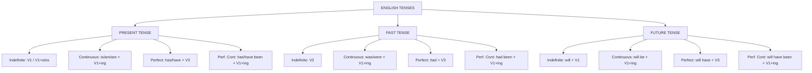

# TENSES
> Tenses denote the **time of action** in a sentence.
## Overview

| Tense | Indefinite | Continuous | Perfect | Perfect Continuous |
| :--- | :--- | :--- | :--- | :--- |
| **Present** | V₁ / V₁+s/es | is/am/are + V₁+ing | has/have + V₃ | has/have been + V₁+ing |
| **Past** | V₂ | was/were + V₁+ing | had + V₃ | had been + V₁+ing |
| **Future** | will + V₁ | will be + V₁+ing | will have + V₃ | will have been + V₁+ing |

---
## PRESENT TENSES
### 1. Present Indefinite (Simple Present)
**Use:** Habitual actions, universal truths, fixed schedules, general facts  

| Type | Structure |
| :--- | :--- |
| ✅ | **III sing:** Subject + V₁+s/es + Object **Others:** Subject + V₁ + Object |
| ❌ | **III sing:** Subject + doesn't + V₁ + Object **Others:** Subject + don't + V₁ + Object |
| ❓ | **III sing:** Does + Subject + V₁ + Object? **Others:** Do + Subject + V₁ + Object? |

**Examples:**
- She eats an orange. (Habitual)  
- The Sun rises in the morning. (Universal truth)  
- The bell rings at 8:50 AM. (Fixed schedule)  
> ⚠️ **NEVER Case:** **Never** use V₁+s/es with plural subjects or "I/You/We/They". (e.g., ❌ *They eats apples.* → ✅ *They eat apples.*)
---
### 2. Present Continuous
**Use:** Actions happening now, temporary situations, planned future events  

| Type | Structure |
| :--- | :--- |
| ✅ | **III sing:** Subject + is + V₁+ing + Object **Others:** Subject + are + V₁+ing + Object **I:** I + am + V₁+ing + Object |
| ❌ | **III sing:** Subject + isn't + V₁+ing + Object **Others:** Subject + aren't + V₁+ing + Object **I:** I + am not + V₁+ing + Object |
| ❓ | **III sing:** Is + Subject + V₁+ing + Object? **Others:** Are + Subject + V₁+ing + Object? **I:** Am I + V₁+ing + Object? |

**Examples:**
- She is eating an orange. (Now)  
- The stars are shining brightly tonight. (Current state)  
- Our classes are starting late this week. (Temporary)  
> ⚠️ **NEVER Case:** **Never** use continuous forms with stative verbs for perception or emotion like *know, love, believe, understand, hate*. (e.g., ❌ *I am knowing the answer.* → ✅ *I know the answer.*)
---
### 3. Present Perfect
**Use:** Recently completed actions, past actions with present relevance  

| Type | Structure |
| :--- | :--- |
| ✅ | **III sing:** Subject + has + V₃ + Object **Others:** Subject + have + V₃ + Object |
| ❌ | **III sing:** Subject + hasn't + V₃ + Object **Others:** Subject + haven't + V₃ + Object |
| ❓ | **III sing:** Has + Subject + V₃ + Object? **Others:** Have + Subject + V₃ + Object? |

**Examples:**
- She has eaten her orange. (Recently completed)  
- The bell has just rung. (Immediate past)  
- I have eaten my breakfast already. (Present relevance)  
> ⚠️ **NEVER Case:** **Never** use Present Perfect with specific past time expressions like *yesterday, last night, in 2010, ago*. (e.g., ❌ *I have met him yesterday.* → ✅ *I met him yesterday.*)
---
### 4. Present Perfect Continuous
**Use:** Actions started in past, continuing to present (emphasizes duration)  

| Type | Structure |
| :--- | :--- |
| ✅ | **III sing:** Subject + has been + V₁+ing + Object + **since/for** + Time **Others:** Subject + have been + V₁+ing + Object + **since/for** + Time |
| ❌ | **III sing:** Subject + hasn't been + V₁+ing + Object + since/for + Time **Others:** Subject + haven't been + V₁+ing + Object + since/for + Time |
| ❓ | **III sing:** Has + Subject + been + V₁+ing + Object + since/for + Time? **Others:** Have + Subject + been + V₁+ing + Object + since/for + Time? |

> **for** → duration (for two hours) | **since** → starting point (since 2 PM)
**Examples:**
- She has been eating healthy food **for** a month.  
- I have been eating apples **since** I was a child.  
> ⚠️ **NEVER Case:** **Never** use *since* with a duration or *for* with a specific starting time point. (e.g., ❌ *Since two hours* → ✅ *For two hours*)
---
## PAST TENSES
### 5. Past Indefinite (Simple Past)
**Use:** Completed actions at specific past time, past habits, historical facts  

| Type | Structure |
| :--- | :--- |
| ✅ | **All:** Subject + V₂ + Object |
| ❌ | **All:** Subject + didn't + V₁ + Object |
| ❓ | **All:** Did + Subject + V₁ + Object? |

**Examples:**
- She ate an orange yesterday. (Completed)  
- The Sun rose at 5:45 AM. (Specific time)  
- Lions lived in this valley many years ago. (Historical)  
> ⚠️ **NEVER Case:** **Never** use V₂ after *did* or *didn't*. Always revert to V₁. (e.g., ❌ *She didn't ate.* → ✅ *She didn't eat.*)
---
### 6. Past Continuous
**Use:** Actions ongoing at specific past point, interrupted actions  

| Type | Structure |
| :--- | :--- |
| ✅ | **III sing/I:** Subject + was + V₁+ing + Object **Others:** Subject + were + V₁+ing + Object |
| ❌ | **III sing/I:** Subject + wasn't + V₁+ing + Object **Others:** Subject + weren't + V₁+ing + Object |
| ❓ | **III sing/I:** Was + Subject + V₁+ing + Object? **Others:** Were + Subject + V₁+ing + Object? |

**Examples:**
- She was eating an orange when I arrived. (Interrupted)  
- The stars were shining when the power went out. (Background)  
> ⚠️ **NEVER Case:** **Never** use *were* with singular pronouns like *He, She, It* in real past contexts. (e.g., ❌ *He were writing.* → ✅ *He was writing.*)
---
### 7. Past Perfect
**Use:** Action completed before another past action ("past of the past")  

| Type | Structure |
| :--- | :--- |
| ✅ | **All:** Subject + had + V₃ + Object |
| ❌ | **All:** Subject + hadn't + V₃ + Object |
| ❓ | **All:** Had + Subject + V₃ + Object? |

**Examples:**
- She had eaten the orange before lunch started.  
- The bell had rung before I reached the gate.  
> ⚠️ **NEVER Case:** **Never** use Past Perfect for an isolated past event when no other past event or reference point is mentioned. (e.g., ❌ *I had seen him yesterday.* → ✅ *I saw him yesterday.*)
---
### 8. Past Perfect Continuous
**Use:** Actions started in past and continued up to another past point  

| Type | Structure |
| :--- | :--- |
| ✅ | **All:** Subject + had been + V₁+ing + Object + **since/for** + Time |
| ❌ | **All:** Subject + hadn't been + V₁+ing + Object + since/for + Time |
| ❓ | **All:** Had + Subject + been + V₁+ing + Object + since/for + Time? |

**Examples:**
- She had been eating oranges for weeks to improve her health.  
- The fish had been swimming near the shore all day.  
> ⚠️ **NEVER Case:** **Never** omit *been* in perfect continuous structures. (e.g., ❌ *She had eating for hours.* → ✅ *She had been eating for hours.*)
---
## FUTURE TENSES
### 9. Future Indefinite (Simple Future)
**Use:** Future actions, predictions, sudden decisions  

| Type | Structure |
| :--- | :--- |
| ✅ | **All:** Subject + will + V₁ + Object |
| ❌ | **All:** Subject + won't + V₁ + Object |
| ❓ | **All:** Will + Subject + V₁ + Object? |

**Examples:**
- She will eat an orange tomorrow. (Future action)  
- The Sun will rise at 6:15 AM tomorrow. (Future fact)  
- The stars will shine tonight if it is clear. (Prediction)  
> ⚠️ **NEVER Case:** **Never** use *will* in conditional/time clauses introduced by *if, when, as soon as, before, after*. (e.g., ❌ *If it will rain, I will stay.* → ✅ *If it rains, I will stay.*)
---
### 10. Future Continuous
**Use:** Actions in progress at specific future time  

| Type | Structure |
| :--- | :--- |
| ✅ | **All:** Subject + will be + V₁+ing + Object |
| ❌ | **All:** Subject + won't be + V₁+ing + Object |
| ❓ | **All:** Will + Subject + be + V₁+ing + Object? |

**Examples:**
- She will be eating her orange during the break.  
- I will be eating my apple when you arrive.  
> ⚠️ **NEVER Case:** **Never** omit *be* after *will* when forming continuous tenses. (e.g., ❌ *She will eating soon.* → ✅ *She will be eating soon.*)
---
### 11. Future Perfect
**Use:** Actions completed by a certain future point  

| Type | Structure |
| :--- | :--- |
| ✅ | **All:** Subject + will have + V₃ + Object |
| ❌ | **All:** Subject + won't have + V₃ + Object |
| ❓ | **All:** Will + Subject + have + V₃ + Object? |

**Examples:**
- She will have eaten her orange before the teacher arrives.  
- I will have eaten my breakfast by 8 AM.  
> ⚠️ **NEVER Case:** **Never** use *will has* with singular subjects. *Will* is a modal auxiliary and always takes the base form *have*. (e.g., ❌ *She will has finished.* → ✅ *She will have finished.*)
---
### 12. Future Perfect Continuous
**Use:** Actions continuing up until a future point (emphasizes duration)  

| Type | Structure |
| :--- | :--- |
| ✅ | **All:** Subject + will have been + V₁+ing + Object + **since/for** + Time |
| ❌ | **All:** Subject + won't have been + V₁+ing + Object + since/for + Time |
| ❓ | **All:** Will + Subject + have been + V₁+ing + Object + since/for + Time? |

**Examples:**
- She will have been eating a balanced diet for a year by December.  
- The lions will have been living in this reserve for fifty years by 2030.  
> ⚠️ **NEVER Case:** **Never** use *since* to denote future duration in Future Perfect Continuous; use *from* or *for*. (e.g., ❌ *Will have been working since next week* → ✅ *Will have been working from next week*)
---
## QUICK REFERENCE
### Verb Forms

| Form | Name | Example |
| :--- | :--- | :--- |
| **V₁** | Base Form | eat, play, go |
| **V₂** | Past Simple | ate, played, went |
| **V₃** | Past Participle | eaten, played, gone |
| **V₁+ing** | Present Participle | eating, playing, going |

### Subject Categories

| Category | Subjects |
| :--- | :--- |
| **III sing** | He, She, It, Singular nouns |
| **Others** | I, You, We, They, Plural nouns |

### Key Words

| Tense Type | Signal Words |
| :--- | :--- |
| **Indefinite** | always, usually, often, every day, never |
| **Continuous** | now, at present, at this moment, currently |
| **Perfect** | already, just, yet, recently, lately |
| **Perfect Continuous** | for, since, all day, how long |

---
## PRACTICE MCQS
### Sentence Type Conversion Questions
1. **Convert to Negative:** *"She has completed her project."*  
   - A) She does not complete her project.  
   - B) She has not completed her project.  
   - C) She had not completed her project.  
   - D) She is not completing her project.  
   

   
<b>View Answer</b>

   <b>Correct Answer: B</b> 
   <i>Explanation:</i> Present Perfect negative structure is Subject + has/have not + V₃.
   
  
2. **Convert to Interrogative:** *"They ate all the oranges."*  
   - A) Have they eaten all the oranges?  
   - B) Do they eat all the oranges?  
   - C) Did they eat all the oranges?  
   - D) Were they eating all the oranges?  
   

   
<b>View Answer</b>

   <b>Correct Answer: C</b> 
   <i>Explanation:</i> Past Indefinite question format requires <i>Did + Subject + V₁</i>.
   
  
3. **Convert Affirmative to Future Continuous:** *"He writes an essay."*  
   - A) He will write an essay.  
   - B) He will have written an essay.  
   - C) He will be writing an essay.  
   - D) He will have been writing an essay.  
   

   
<b>View Answer</b>

   <b>Correct Answer: C</b> 
   <i>Explanation:</i> Future Continuous structure is Subject + will be + V₁+ing.
   
  
---
### Tense to Tense Conversion Questions
4. **Convert Present Continuous to Past Perfect:** *"I am studying for the exam."*  
   - A) I studied for the exam.  
   - B) I was studying for the exam.  
   - C) I had studied for the exam.  
   - D) I have studied for the exam.  
   

   
<b>View Answer</b>

   <b>Correct Answer: C</b> 
   <i>Explanation:</i> Past Perfect uses <i>had + V₃</i> ("had studied").
   
  
5. **Convert Past Indefinite to Present Perfect Continuous:** *"She lived in Mumbai for five years."*  
   - A) She was living in Mumbai for five years.  
   - B) She has been living in Mumbai for five years.  
   - C) She had been living in Mumbai for five years.  
   - D) She lives in Mumbai since five years.  
   

   
<b>View Answer</b>

   <b>Correct Answer: B</b> 
   <i>Explanation:</i> Present Perfect Continuous requires <i>has/have been + V₁+ing</i>.
   
  
6. **Convert Future Indefinite to Past Continuous:** *"They will play football."*  
   - A) They played football.  
   - B) They had played football.  
   - C) They were playing football.  
   - D) They had been playing football.  
   

   
<b>View Answer</b>

   <b>Correct Answer: C</b> 
   <i>Explanation:</i> Past Continuous uses <i>was/were + V₁+ing</i> ("were playing" for plural subject).
   
  
---
## TENSES SUMMARY DIAGRAM
