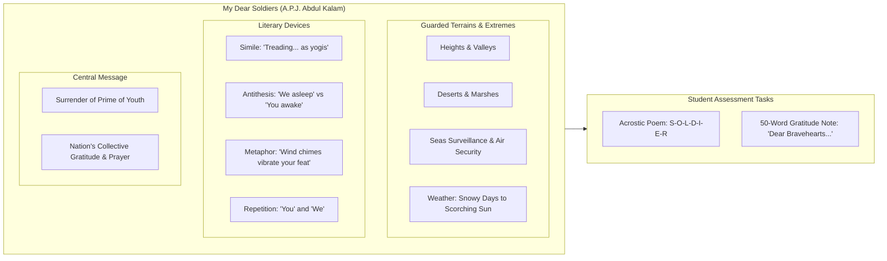
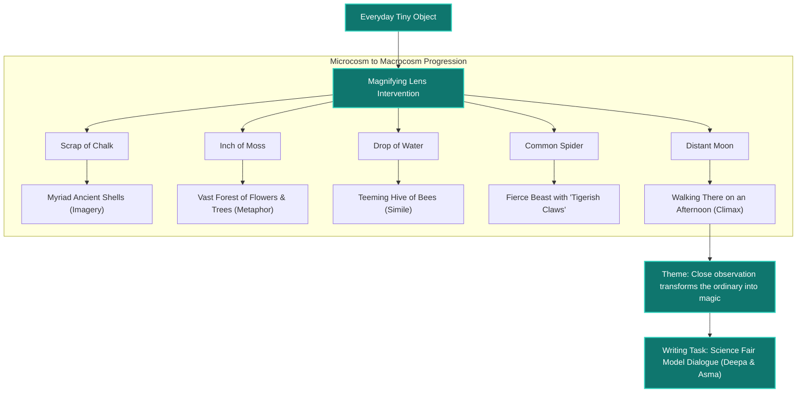
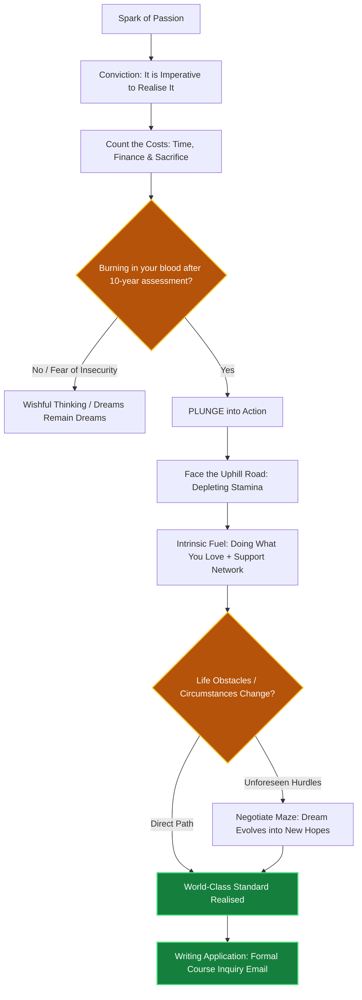

Here are **5 clear, syntactically verified Mermaid diagrams** covering the master curriculum overview as well as dedicated deep-dive maps for each of the four units. 

You can preview or check them directly in any Markdown viewer (GitHub, Obsidian, Notion) or paste them into the [Mermaid Live Editor](https://mermaid.live).

---

### 1. Master Curriculum Map (All 4 Units Overview)

```mermaid
flowchart TD
    ROOT["Four English Study Units"] --> U1["Unit 1: My Dear Soldiers"]
    ROOT --> U2["Unit 2: Magnifying Glass"]
    ROOT --> U3["Unit 3: Follow That Dream"]
    ROOT --> U4["Unit 4: Madam Rides the Bus"]

    %% Unit 1
    U1 --> U1_A["Author: Dr. A.P.J. Abdul Kalam"]
    U1 --> U1_B["Genre: Patriotic Hymn / Free Verse"]
    U1 --> U1_C["Core Focus: Sacrifice, Vigilance, Harsh Terrains"]
    U1 --> U1_D["Final Output: Acrostic Poem & 50-Word Note"]

    %% Unit 2
    U2 --> U2_A["Author: Walter de la Mare"]
    U2 --> U2_B["Genre: Rhyming Quatrains (ABCB)"]
    U2 --> U2_C["Core Focus: Microscopic Wonder to Celestial Scale"]
    U2 --> U2_D["Final Output: Scripted Peer Dialogue"]

    %% Unit 3
    U3 --> U3_A["Author: Irene Chua"]
    U3 --> U3_B["Genre: Epistolary Prose (Mother's Letter)"]
    U3 --> U3_C["Core Focus: 10-Year Dedication & Cost Evaluation"]
    U3 --> U3_D["Final Output: Formal Inquiry Email"]

    %% Unit 4
    U4 --> U4_A["Author: Vallikkannan"]
    U4 --> U4_B["Genre: Realistic Short Fiction"]
    U4 --> U4_C["Core Focus: Autonomy, Wit & Confronting Mortality"]
    U4 --> U4_D["Final Output: Character Analysis & Extract MCQs"]

    classDef unit fill:#1e293b,stroke:#38bdf8,stroke-width:2px,color:#f8fafc;
    classDef sub fill:#334155,stroke:#94a3b8,stroke-width:1px,color:#f1f5f9;
    class U1,U2,U3,U4 unit;
    class U1_A,U1_B,U1_C,U1_D,U2_A,U2_B,U2_C,U2_D,U3_A,U3_B,U3_C,U3_D,U4_A,U4_B,U4_C,U4_D sub;
```

---

### 2. Unit 1: "My Dear Soldiers" (Thematic & Device Breakdown)

---

### 3. Unit 2: "Magnifying Glass" (Progression of Scale)

---

### 4. Unit 3: "Follow That Dream" (Action & Decision Roadmap)

---

### 5. Unit 4: "Madam Rides the Bus" (Narrative Arc & Emotional Shift)

```mermaid
flowchart TD
    subgraph PHASE1["1. Planning & Restraint (Village)"]
        P1["Overwhelming desire to ride the bus"] --> P2["Discreet information gathering: 6 miles, 30 paise, 45 mins"]
        P2 --> P3["Self-denial: Resists sweets, toys, merry-go-round"]
        P3 --> P4["Time coordination: Mothers afternoon nap (1:00 - 2:45 PM)"]
    end

    subgraph PHASE2["2. Journey Outward (Delight & Autonomy)"]
        P4 --> J1["Boards bus commandingly: Rejects being called 'Child'"]
        J1 --> J2["Enjoys canal, mountains, green fields"]
        J2 --> J3["COMIC HIGHLIGHT: Young cow galloping in front of bus"]
        J3 --> J4["Valli laughs until tears come"]
    end

    subgraph PHASE3["3. In the Town (Self-Possessed Caution)"]
        J4 --> T1["Remains on the bus; buys return ticket"]
        T1 --> T2["Refuses conductor's free cold drink (Self-respect & Safety)"]
    end

    subgraph PHASE4["4. Return Journey (The Confrontation with Death)"]
        T2 --> R1["Sees the same cow dead, bloodied by roadside"]
        R1 --> R2["Dampened spirits: Sits glued to her seat, silence replaces laughter"]
        R2 --> R3["Epiphany: Fragility and harsh reality of life"]
    end

    subgraph PHASE5["5. Resolution (Secret Smile)"]
        R3 --> H1["Arrives safely home unnoticed"]
        H1 --> H2["Mother & Aunt discuss unknown events in the world"]
        H2 --> H3["Valli agrees: 'Oh, yes!' — Smiled with private mature wisdom"]
    end

    classDef p1 fill:#1e3a8a,stroke:#60a5fa,color:#fff;
    classDef p2 fill:#065f46,stroke:#34d399,color:#fff;
    classDef p3 fill:#78350f,stroke:#f59e0b,color:#fff;
    classDef p4 fill:#831843,stroke:#f472b6,color:#fff;
    classDef p5 fill:#312e81,stroke:#a5b4fc,color:#fff;

    class P1,P2,P3,P4 p1;
    class J1,J2,J3,J4 p2;
    class T1,T2 p3;
    class R1,R2,R3 p4;
    class H1,H2,H3 p5;
```

